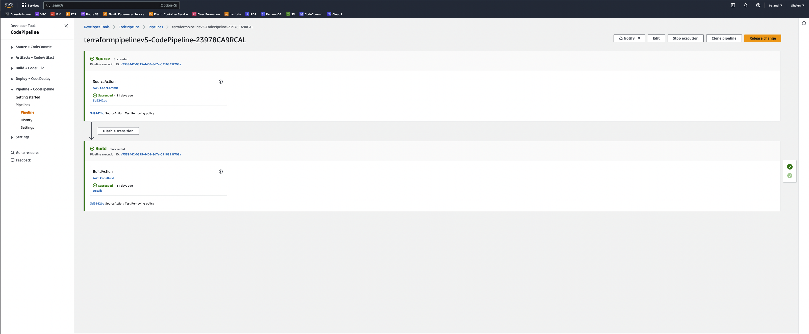
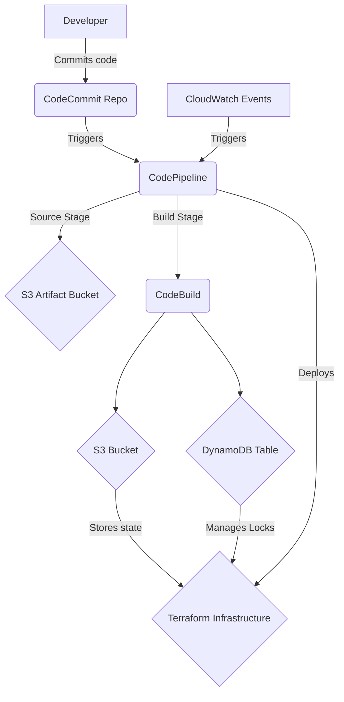

# Using CloudFormation to setup a robust CI/CD Pipeline for Terraform Code Testing and Deployment

## Overview

This repository contains an AWS CloudFormation template which orchestrates a CI/CD pipeline for Terraform code. The pipeline automatically validates, plans, and applies Terraform code every time changes are pushed to a specified AWS CodeCommit repository.

The pipeline deploys AWS resources such as S3 bucket for storing Terraform state files, DynamoDB table for managing state lock, and AWS CodeCommit repository to store the Terraform code. It also utilizes AWS CodeBuild for executing terraform commands and AWS CodePipeline to handle the overall orchestration of the CI/CD flow.

The pipeline is triggered whenever there is a change in the AWS CodeCommit repository, thanks to CloudWatch Events.

## Screenshots
 

## Flow Diagram

## Explanation of the Flow

- A developer pushes a change to the AWS CodeCommit repository.
- This triggers a CloudWatch Event Rule which starts the CodePipeline.
- The CodePipeline retrieves the source code from the CodeCommit repository and initiates the CodeBuild project.
- CodeBuild runs Terraform commands to validate, plan, and apply the changes to the environment. This process involves interaction with an S3 Bucket (for storing Terraform state files) and a DynamoDB Table (for managing state locks).
- All the logs from CodeBuild during the execution are stored in CloudWatch Logs which aids in monitoring the pipeline execution.

#### Please make note of all the resources are created using the AWS CloudFormation template present in the repository for costs that may be incurred during deployment.

## Deployment Steps

1. Clone this repository: `git clone https://github.com/shalennaidoo/Terraform-CICD-Pipeline.git`
2. Open the AWS CloudFormation console.
3. Click 'Create Stack'.
4. In the 'Specify template' section, choose 'Upload a template file'.
5. Click 'Choose file', and then find and select your CloudFormation template file.
6. Click 'Next', and then enter a stack name and any required parameters.
7. Click 'Next' to proceed through the 'Configure stack options' page, adding any necessary tags and configuring permissions as necessary.
8. Click 'Next', review the information for the stack, and then click 'Create stack'.
9. Wait for the status of the stack to change to 'CREATE_COMPLETE'.

